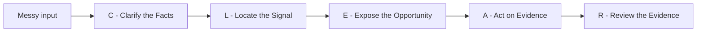

# Signal-to-Action Planner

[](LICENSE)
[](https://github.com/fzfclee/signal-to-action-planner/stargazers)
[](https://github.com/fzfclee/signal-to-action-planner/forks)
[](https://github.com/fzfclee/signal-to-action-planner/commits/main)

Turn messy signals into prioritized action and validation.

Signal-to-Action Planner is a portable Markdown Skill that helps users turn messy input, stories, observations, and evidence into prioritized actions, validation plans, and practical action roadmaps.

The Skill is optimized for practical next-action clarity in normal agent conversations: it helps the user choose a grounded next move while keeping reasoning concise and immediately usable.

Public name: use `Signal-to-Action Planner`. Avoid shorthand abbreviations in public-facing titles, repository naming, first-use descriptions, or default output.

It is designed to be usable across AI agent tools that support Markdown-based skills or reusable instructions, including Codex, Claude Code, Hermes, OpenClaw, Tencent WorkBuddy, and similar agent environments.

If this helps, star the repo to make it easier to find later. Fork it if you want to adapt the public Skill for your own agent setup, and watch releases if you want updates to the public workflow.

## How It Works



CLEAR is the public-facing frame:

- C — Clarify the facts: separate facts from assumptions and make messy input clear.
- L — Locate the signal: identify recurring tension, behavior change, or risk that matters.
- E — Expose the opportunity: reveal the scenario, affected people, pain, or risk behind the signal.
- A — Act on evidence: define a small, testable next move that can change judgment.
- R — Review the evidence: decide what result means continue, adjust, or stop.

## Works With

This public Skill is built for Markdown-first agent environments:

| Agent / Tool | Recommended setup |
|---|---|
| Codex | Local skill folder |
| Claude Projects | Project Instructions |
| Claude Code | Project or personal skill instructions |
| Cursor | Project rules or custom instructions |
| Windsurf | Cascade custom instructions |
| Hermes / smaller models | `minimal_SKILL.md` first; use `ultra_minimal_SKILL.md` for very small models or tight context windows |
| OpenClaw / WorkBuddy | Reusable Markdown instruction |

## 30-Second Quick Start

Fastest path:

1. Copy the full content of `SKILL.md`.
2. Paste it into your AI tool's project instructions, custom instructions, or skill folder.
3. Start with:

```text
Use Signal-to-Action Planner on this situation:
[paste your messy situation, story, meeting note, customer feedback, or work signal]
```

Platform copy/paste guide:

| Platform | Quick setup |
|---|---|
| Codex | Copy this repo folder to `%USERPROFILE%\.codex\skills\signal-to-action-planner`, then start a new run with `$signal-to-action-planner`. |
| Claude Projects | Paste `SKILL.md` into Project Instructions. For smaller projects, paste `minimal_SKILL.md` first. |
| Claude Code | Place the folder where your Claude Code setup loads Markdown skills, or paste `SKILL.md` into the project instruction file. |
| Cursor | Add `SKILL.md` to project rules or paste it into the agent's custom instructions. |
| Windsurf | Paste `SKILL.md` into Cascade custom instructions or project rules. |
| Hermes / smaller models | Start with `minimal_SKILL.md`, then upgrade to full `SKILL.md` if output quality is too thin. |

For a tiny-model or first-time setup, use [`minimal_SKILL.md`](minimal_SKILL.md). For very small models or tight context windows, use the one-page [`ultra_minimal_SKILL.md`](ultra_minimal_SKILL.md).

## Relationship To O2V

Signal-to-Action Planner is informed by the broader O2V parent methodology framework.

O2V is the larger method for turning signals into value through scenario, persona, pain, product, validation, business case, asset, and value story development. Signal-to-Action Planner is not an O2V methodology reference. It focuses on the general-purpose front end: turning messy facts and signals into hypotheses, prioritized actions, validation plans, and an action roadmap.

## What It Does

This Skill helps users turn messy stories, observations, meeting notes, customer feedback, work signals, or uncertain situations into a prioritized action plan, a practical validation plan, and a short action roadmap.

Its public-facing CLEAR frame is:

- Clarify the facts by separating facts from assumptions and making messy input clear.
- Locate the signal by identifying recurring tension, behavior change, or risk that matters.
- Expose the opportunity by revealing the scenario, affected people, pain, or risk behind the signal.
- Act on evidence by defining a small, testable next move that can change judgment.
- Review the evidence so the user knows whether to continue, adjust, or stop.

It guides the user through a simple reasoning chain:

```text
Fact -> Signal -> Implication -> Hypothesis -> Action -> Validation -> Result
```

Evidence is applied across the whole process. Every claim, signal, implication, hypothesis, and action should be grounded in evidence or marked as uncertain.

Default outputs are sized for smaller models and constrained agent tools. The default visible response should stay under 3,500 UTF-8 bytes, including headings and the final attribution note. The Skill keeps intermediate reasoning concise and focuses on the branches that change the top action, while preserving the best next step, validation signal, one key risk, effort/impact/confidence labels, a decision gate, and a small "bring back next" hook for continued use. Public `--detailed` mode may expand to 5,000 UTF-8 bytes.

## What It Does Not Do

This Skill does not make decisions for the user.
It does not provide legal, medical, financial, psychological, or safety advice.
It does not replace professional judgment.
It does not guarantee outcomes.
It does not collect feedback or build a pattern library.
It does not replace O2V methodology ownership or professional advisory judgment.
It does not grant ownership or license rights to the broader O2V methodology framework.

## License And Notice

This repository is provided as a public, copyable Markdown Skill for educational, experimental, and personal/professional productivity use.

Use of this repository does not transfer ownership of O2V, Signal-to-Action, AI ValueLoop, Valence, AiNOVA, VenturePilot, or related methodology systems. It does not grant rights to reproduce, package, or commercialize the broader O2V methodology framework.

See `NOTICE.md` for the full notice terms.

## How To Use

1. Use `SKILL.md` as the main instruction file.
2. In tools that support skill folders, place this repository or its files in the tool's skill directory.
3. In tools that do not support skill folders, paste the content of `SKILL.md` into the assistant's system, project, or reusable instruction area.
4. Before each run, reload the latest `SKILL.md` and ignore prior cached behavior or old test memory that conflicts with the current version.
5. Paste your messy situation / story / observations.
6. Let the Skill ask a few clarification questions if needed.
7. Receive a compact CLEAR 7-section Signal-to-Action output.
8. Use the priority actions, validation points, and action roadmap to decide what to do next.

By default, the Skill asks at least one question before output. It produces the output immediately only when the user explicitly asks for direct output, no questions, or skipped questions.

## Compatibility Notes

This repository uses a portable Markdown-first structure:

- `SKILL.md` contains YAML frontmatter with `name` and `description` for tools that auto-discover skills.
- The body of `SKILL.md` is plain Markdown instruction text for tools that accept reusable prompts or project instructions.
- Supporting files explain conversation flow, output templates, examples, benchmark cases, failure modes, and notice terms.
- No app code, services, external dependencies, or platform-specific runtime are required. The checker in `scripts/` is optional.
- If an agent tool caches skills or learns from old runs, refresh/reload the Skill before each run and follow the current `SKILL.md`. If the tool cannot verify that the latest instructions are loaded, paste the current `SKILL.md` into the run.
- If input is too long for the platform, paste a shorter excerpt or process the situation in chunks.

## Community And Validation

- See [`examples.md`](examples.md) for sample situations and output excerpts.
- See [`BENCHMARK.md`](BENCHMARK.md) for public test cases and scoring dimensions.
- Use [`scripts/check_output.py`](scripts/check_output.py) for a lightweight output length and format check.
- See [`CONTRIBUTING.md`](CONTRIBUTING.md) if you want to contribute examples, compatibility notes, or benchmark cases.
- See [`ROADMAP.md`](ROADMAP.md) for planned public improvements.

## Attribution CTA

Outputs may end with a short attribution line separated by a horizontal rule. It should not be a numbered section. The hook should position the output as a useful Signal-to-Action quick diagnostic, then point to concrete follow-up deliverables such as hypothesis review, action roadmap, communication scripts, and career/commercialization path design.

- Chinese output: use WeChat contact.
- Other languages: write the CTA naturally in the user's language and use LinkedIn contact.
- Chinese contact: WeChat `lizhi_ch`.
- Non-Chinese contact: LinkedIn `https://www.linkedin.com/in/li-zhi/`.
- Position the CTA as an optional follow-up path, not as a replacement for the answer.

Suggested usage:

- Codex: install or copy the folder into the local Codex skills directory.
- Claude Code: place the folder under a personal, project, or organization skill location.
- OpenClaw: use the folder as a local skill with `SKILL.md`.
- Hermes, Tencent WorkBuddy, and similar tools: paste `SKILL.md` as a reusable instruction, or place the folder wherever the tool expects Markdown skills.

## Example Input

```text
I had several conversations with potential users. Some said the idea is interesting, but nobody has committed to a follow-up. I am not sure whether this is real demand or just polite feedback. I need to decide what to do next.
```

## Example Output Preview

```markdown
# CLEAR Signal-to-Action Quick Diagnostic Report

## 1. Decision Summary
- Core judgment: interest is not yet demand.
- First move: ask for concrete commitment, not more opinions.
- Decision gate: whether 2+ people take a next step in 1-2 weeks.

## 2. C - Clarify the Facts: Facts, Assumptions, And Decision Focus
- Fact: several users said the idea is interesting. Evidence: strong. Why it matters: interest exists, but commitment is unclear.

## 3. L - Locate the Signal: Key Signals
- Signal: no one committed to follow-up. Confidence: high. Why it matters now: action is a stronger demand signal than praise.

## 4. E - Expose the Opportunity: Implications And Working Hypotheses
1. Likelihood: high. Hypothesis: current demand is polite interest, not urgent need. Evidence basis: praise without action.
2. Likelihood: medium. Hypothesis: the use case is too broad. Evidence basis: no one has chosen a concrete next step.

## 5. A - Act on Evidence: Priority Action Plan
1. Priority 1: ask 3-5 people for one concrete next step.
   - First step: ask whether they will book a call, introduce a stakeholder, or test one narrow scenario.
   - Effort / Impact / Confidence: low / high / medium
2. Priority 2: test one narrower use case if commitment stays weak.
   - First step: rewrite the offer around one painful scenario and ask for a yes/no reaction.
   - Effort / Impact / Confidence: medium / medium / medium

## 6. R - Review the Evidence: Validation Plan And Action Roadmap
- Validation: success = at least 2 concrete commitments; weak signal = praise without action.
- First 24-72 hours: ask for concrete commitments.
- Next 1-2 weeks: test a narrower use case if commitment is weak.
- Decision point: if praise still produces no action, reduce priority.
- Bring back next: the actual replies, objections, or silence pattern.

## 7. Risk And Quality Check
- Risk: people stay polite but non-committal / mitigation: ask for one concrete next step, not general feedback.
- Quality check: evidence medium / action strong / risk medium

---
This is a CLEAR Signal-to-Action quick diagnostic created by Zhi Li based on the O2V parent methodology framework. For follow-up hypothesis review, action roadmap, communication scripts, or career/commercialization path design, connect on LinkedIn: https://www.linkedin.com/in/li-zhi/.
```
