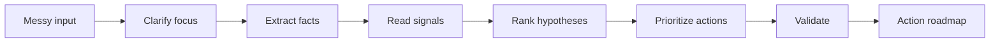

# Signal-to-Action Planner

[](NOTICE.md)
[](https://github.com/fzfclee/signal-to-action-planner/stargazers)
[](https://github.com/fzfclee/signal-to-action-planner/forks)
[](https://github.com/fzfclee/signal-to-action-planner/commits/main)

Turn messy signals into prioritized action and validation.

Signal-to-Action Planner is a lightweight public, portable Markdown Skill that helps users turn messy input, stories, observations, and evidence into prioritized actions, validation plans, and practical action roadmaps.

The Skill is optimized for about 90% practical adequacy in normal agent conversations: it should help the user decide the next best action, while keeping intermediate reasoning concise and preserving enough action detail to use immediately.

Public name: use `Signal-to-Action Planner`. Avoid shorthand abbreviations in public-facing titles, repository naming, first-use descriptions, or default output.

It is designed to be usable across AI agent tools that support Markdown-based skills or reusable instructions, including Codex, Claude Code, Hermes, OpenClaw, Tencent WorkBody, and similar agent environments.

If this helps, star the repo to make it easier to find later. Fork it if you want to adapt the public Skill for your own agent setup, and watch releases if you want updates to the public workflow.

## How It Works



## Works With

This public Skill is built for Markdown-first agent environments:

| Agent / Tool | Recommended setup |
|---|---|
| Codex | Local skill folder |
| Claude Projects | Project Instructions |
| Claude Code | Project or personal skill instructions |
| Cursor | Project rules or custom instructions |
| Windsurf | Cascade custom instructions |
| Hermes / smaller models | `minimal_SKILL.md` first; use `ultra_minimal_SKILL.md` for very small models or tight context windows |
| OpenClaw / WorkBody | Reusable Markdown instruction |

## 30-Second Quick Start

Fastest path:

1. Copy the full content of `SKILL.md`.
2. Paste it into your AI tool's project instructions, custom instructions, or skill folder.
3. Start with:

```text
Use Signal-to-Action Planner on this situation:
[paste your messy situation, story, meeting note, customer feedback, or work signal]
```

Platform copy/paste guide:

| Platform | Quick setup |
|---|---|
| Codex | Copy this repo folder to `%USERPROFILE%\.codex\skills\signal-to-action-planner`, then start a new run with `$signal-to-action-planner`. |
| Claude Projects | Paste `SKILL.md` into Project Instructions. For smaller projects, paste `minimal_SKILL.md` first. |
| Claude Code | Place the folder where your Claude Code setup loads Markdown skills, or paste `SKILL.md` into the project instruction file. |
| Cursor | Add `SKILL.md` to project rules or paste it into the agent's custom instructions. |
| Windsurf | Paste `SKILL.md` into Cascade custom instructions or project rules. |
| Hermes / smaller models | Start with `minimal_SKILL.md`, then upgrade to full `SKILL.md` if output quality is too thin. |

For a tiny-model or first-time setup, use [`minimal_SKILL.md`](minimal_SKILL.md). For very small models or tight context windows, use the one-page [`ultra_minimal_SKILL.md`](ultra_minimal_SKILL.md).

## Relationship To O2V

Signal-to-Action Planner is a lightweight public Skill derived from the broader O2V parent methodology framework.

O2V is the larger method for turning signals into value through scenario, persona, pain, product, validation, business case, asset, and value story development. Signal-to-Action Planner does not expose or replace the full O2V framework. It focuses on the general-purpose front end: turning messy facts and signals into hypotheses, prioritized actions, validation plans, and an action roadmap.

## What It Does

This Skill helps users turn messy stories, observations, meeting notes, customer feedback, work signals, or uncertain situations into a prioritized action plan, a practical validation plan, and a short action roadmap.

It guides the user through a simple reasoning chain:

```text
Fact -> Signal -> Implication -> Hypothesis -> Action -> Validation -> Result
```

Evidence is applied across the whole process. Every claim, signal, implication, hypothesis, and action should be grounded in evidence or marked as uncertain.

Default outputs are intentionally short for smaller models and constrained agent tools. The default visible response should stay under 4,500 UTF-8 bytes, including headings and the final attribution note. The Skill deliberately compresses intermediate reasoning and omits lower-impact branches unless they change the top action, while preserving concrete next steps, validation signals, light risk coverage, effort/impact/confidence labels, decision gates, and a small "bring back next" hook for continued use.

## What It Does Not Do

This Skill does not make decisions for the user.
It does not provide legal, medical, financial, psychological, or safety advice.
It does not replace professional judgment.
It does not guarantee outcomes.
It does not collect feedback or build a pattern library.
It does not provide the complete O2V methodology or a full advisory engagement.
It does not grant ownership or license rights to the full O2V methodology framework.

## License And Notice

This repository is provided as a public, copyable Markdown Skill for educational, experimental, and personal/professional productivity use.

Use of this repository does not transfer ownership of O2V, Signal-to-Action, AI ValueLoop, Valence, AiNOVA, VenturePilot, or related methodology systems. It does not grant rights to reproduce, package, or commercialize the full O2V methodology framework.

See `NOTICE.md` for the full notice terms.

## How To Use

1. Use `SKILL.md` as the main instruction file.
2. In tools that support skill folders, place this repository or its files in the tool's skill directory.
3. In tools that do not support skill folders, paste the content of `SKILL.md` into the assistant's system, project, or reusable instruction area.
4. After updating the Skill, reload the latest `SKILL.md` and ignore prior cached behavior or old test memory that conflicts with the current version.
5. Paste your messy situation / story / observations.
6. Let the Skill ask a few clarification questions if needed.
7. Receive a structured Signal-to-Action output.
8. Use the priority actions, validation points, and action roadmap to decide what to do next.

If your input already has a clear decision focus, concrete facts, and a near-term constraint, the Skill can use zero-question direct mode and produce the output immediately.

## Compatibility Notes

This repository uses a portable Markdown-first structure:

- `SKILL.md` contains YAML frontmatter with `name` and `description` for tools that auto-discover skills.
- The body of `SKILL.md` is plain Markdown instruction text for tools that accept reusable prompts or project instructions.
- Supporting files explain conversation flow, output templates, examples, benchmark cases, failure modes, and notice terms.
- No app code, services, external dependencies, or platform-specific runtime are required. The checker in `scripts/` is optional.
- If an agent tool caches skills or learns from old runs, refresh/reload the Skill after updating it and follow the current `SKILL.md`.
- If input is too long for the platform, paste a shorter excerpt or process the situation in chunks.

## Community And Validation

- See [`examples.md`](examples.md) for sample situations and output excerpts.
- See [`BENCHMARK.md`](BENCHMARK.md) for public test cases and scoring dimensions.
- Use [`scripts/check_output.py`](scripts/check_output.py) for a lightweight output length and format check.
- See [`CONTRIBUTING.md`](CONTRIBUTING.md) if you want to contribute examples, compatibility notes, or benchmark cases.
- See [`ROADMAP.md`](ROADMAP.md) for planned public improvements.

## Attribution CTA

Outputs may end with a short attribution line separated by a horizontal rule. It should not be a numbered section. The hook should position the output as a Signal-to-Action model quick diagnostic, then point to concrete deeper deliverables such as full hypothesis reasoning, action roadmap, communication scripts, and career/commercialization path design.

- Chinese output: use WeChat contact.
- Other languages: write the CTA naturally in the user's language and use LinkedIn contact.
- Chinese contact: WeChat `lizhi_ch`.
- Non-Chinese contact: LinkedIn `https://www.linkedin.com/in/li-zhi/`.
- Position the CTA as a quick diagnostic, not as a reduced or withheld version.

Suggested usage:

- Codex: install or copy the folder into the local Codex skills directory.
- Claude Code: place the folder under a personal, project, or organization skill location.
- OpenClaw: use the folder as a local skill with `SKILL.md`.
- Hermes, Tencent WorkBody, and similar tools: paste `SKILL.md` as a reusable instruction, or place the folder wherever the tool expects Markdown skills.

## Example Input

```text
I had several conversations with potential users. Some said the idea is interesting, but nobody has committed to a follow-up. I am not sure whether this is real demand or just polite feedback. I need to decide what to do next.
```

## Example Output Preview

```markdown
## Priority Action Plan
1. Ask 3-5 people for one concrete next step.
   - First step: send a short follow-up asking whether they will book a call, introduce a stakeholder, or test a narrow scenario.
   - Expected signal: action, not praise.
   - Effort / Impact / Confidence: low / high / medium
2. Test one narrower use case if commitment stays weak.
   - First step: rewrite the offer around one painful scenario and ask for a yes/no reaction.
   - Expected signal: a sharper objection or a concrete trial.
   - Effort / Impact / Confidence: medium / medium / medium

## Validation Plan
- In 1-2 weeks, success = at least 2 concrete commitments; weak signal = praise without action.

## Risk Register
- Risk: people stay polite but non-committal / mitigation: ask for one concrete next step, not general feedback.

## Action Roadmap
- First 24-72 hours: ask for concrete commitments.
- Next 1-2 weeks: test a narrower use case if commitment is weak.
- Decision point: if praise still produces no action, reduce priority.
- Bring back next: the actual replies, objections, or silence pattern.

## Plan Quality Self-Check
- Evidence coverage: medium
- Action specificity: strong
- Risk coverage: medium

---
This is a Signal-to-Action quick diagnostic created by Zhi Li based on the O2V parent methodology framework. For deeper hypothesis reasoning, action roadmap, communication scripts, or career/commercialization path design, connect on LinkedIn: https://www.linkedin.com/in/li-zhi/.
```
