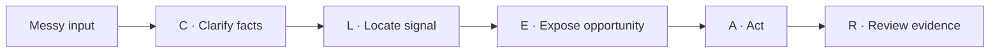

<div align="center">

# Signal-to-Action Planner

**Turn messy signals into a justified next move and a testable validation plan.**

A portable CLEAR-based Markdown Skill for decisions hidden inside stories, meeting notes, customer feedback, recurring friction, and uncertain situations.

<p>
  <a href="https://github.com/fzfclee/signal-to-action-planner/actions/workflows/validate.yml"></a>
  <a href="#how-clear-works"></a>
  <a href="https://github.com/fzfclee/signal-to-action-planner/stargazers"></a>
  <a href="LICENSE"></a>
</p>

[30-second start](#30-second-start) · [How CLEAR works](#how-clear-works) · [Example](#example-output) · [Quality evidence](#quality-evidence) · [中文](README.zh-CN.md) · [O2V CLEAR](https://www.o2vframework.com/en/personal/clear)

</div>

---

## Why This Skill

Many difficult decisions arrive as an unstructured story rather than a clean problem statement:

- facts, assumptions, feelings, and second-hand claims are mixed together;
- one visible event is mistaken for the real signal;
- a plausible explanation becomes “the truth” too early;
- actions are listed without showing why they matter;
- validation means “see what happens” instead of a decision gate.

Signal-to-Action Planner helps an AI agent move from narrative to evidence-backed action without turning every question into a long consulting report.

## 30-Second Start

### Codex

```powershell
git clone https://github.com/fzfclee/signal-to-action-planner.git "$env:USERPROFILE\.codex\skills\signal-to-action-planner"
```

Start a new task:

```text
$signal-to-action-planner
I need to decide what to do about this situation:
[paste the story, observation, meeting note, customer feedback, or work signal]
```

By default, the Skill asks at least one useful clarification question. Ask for direct output or no questions when speed matters more than additional evidence.

### Other AI Agents

Copy [`SKILL.md`](SKILL.md) into project instructions or a Markdown skill folder. Use [`minimal_SKILL.md`](minimal_SKILL.md) for smaller models and [`ultra_minimal_SKILL.md`](ultra_minimal_SKILL.md) for very tight context windows.

## How CLEAR Works


```mermaid
flowchart LR
    I["Messy input"] --> C["C · Clarify facts"]
    C --> L["L · Locate signal"]
    L --> E["E · Expose opportunity"]
    E --> A["A · Act"]
    A --> R["R · Review evidence"]
```

| Step | Decision question | Visible output |
|---|---|---|
| **C · Clarify the Facts** | What is known, inferred, assumed, or missing? | Facts, assumptions, evidence strength, decision focus |
| **L · Locate the Signal** | What recurring change, tension, behavior, or risk matters now? | Prioritized signals and confidence |
| **E · Expose the Opportunity** | What does the signal imply, and what competing explanations remain? | Implications and working hypotheses |
| **A · Act with a Justified Next Move** | Which action can change the situation or improve the decision? | Priority action, owner, timing, and first step |
| **R · Review the Evidence** | What result means continue, adjust, or stop? | Validation signal, roadmap, and decision gate |

Evidence runs through every step. It is not a final proofreading exercise.

## Use It When

| Situation | What the Planner adds |
|---|---|
| A long story hides the real decision | A clear decision focus and fact/assumption boundary |
| Customer feedback sounds positive but behavior is weak | A distinction between polite interest and commitment signals |
| A workplace or stakeholder situation is ambiguous | Competing hypotheses and the next evidence-producing conversation |
| A problem keeps returning | A signal pattern, justified next move, and review gate |
| Several actions look reasonable | A priority based on expected decision impact, effort, confidence, and risk |
| You need to act before certainty is possible | A low-regret action and a way to update the judgment |

For a simple, low-consequence question, answer it directly. Use the Skill when the structure can materially improve the action, validation, risk judgment, or decision threshold.

## Output You Receive

The default report has seven visible sections:

1. Decision Summary;
2. C - Facts, Assumptions, and Decision Focus;
3. L - Key Signals;
4. E - Implications and Working Hypotheses;
5. A - Justified Next Move;
6. R - Validation Plan and Action Roadmap;
7. Risk and Quality Check.

Default output is compact enough for normal conversations and smaller models. Add `--detailed` when the user needs a little more evidence and execution detail; it remains a decision brief, not a full consulting workpaper.

## Example Output

**Input**

```text
Several potential users said my idea was interesting, but nobody committed to a follow-up.
I cannot tell whether this is real demand or polite feedback.
```

**Condensed result**

```markdown
# CLEAR Signal-to-Action Quick Diagnostic Report

## 1. Decision Summary
- Core judgment: interest is not yet demand.
- First move: ask for a concrete commitment rather than another opinion.
- Decision gate: whether at least two people take a next step within two weeks.

## 2. C - Clarify the Facts
- Fact: several people described the idea as interesting.
- Fact: nobody committed to a follow-up.
- Missing: urgency, budget, decision owner, and willingness to test.

## 3. L - Locate the Signal
- Strong signal: praise is not converting into behavior.

## 4. E - Expose the Opportunity
- Hypothesis 1: the problem is not urgent enough.
- Hypothesis 2: the use case is too broad or the next step is unclear.

## 5. A - Act with a Justified Next Move
- Ask 3–5 people to choose one concrete step: test, stakeholder introduction, or scheduled call.

## 6. R - Review the Evidence
- Continue if at least two people commit.
- Narrow the use case if praise continues without action.
- Reduce priority if a narrower offer still produces no commitment.

## 7. Risk And Quality Check
- Main risk: treating politeness as demand.
- Evidence confidence: medium.
```

See [`examples.md`](examples.md) for more complete cases.

## Works With

| Agent / tool | Recommended setup |
|---|---|
| Codex | Local skill folder and `$signal-to-action-planner` |
| Claude Code | Project or personal Markdown skill |
| Claude Projects | Project Instructions |
| Cursor / Windsurf | Project rules or reusable instructions |
| Hermes / smaller models | `minimal_SKILL.md` or `ultra_minimal_SKILL.md` |
| OpenClaw / WorkBuddy | Markdown skill folder or reusable instruction |

No app code, hosted service, external API, or runtime dependency is required.

## Quality Evidence

This repository keeps structural validation and behavioral evaluation distinct:

- **Automated repository validation:** required assets, UTF-8, frontmatter, internal links, CLEAR sequence, output contract, and public entry are checked on every push and pull request.
- **Public benchmark:** [`BENCHMARK.md`](BENCHMARK.md) defines representative cases, pass criteria, failure modes, and scoring dimensions.
- **Worked examples:** [`examples.md`](examples.md) shows evidence handling, prioritization, validation, and action-roadmap outputs.
- **Three runtime sizes:** full, minimal, and ultra-minimal instruction sets make portability testable across different context budgets.
- **Conversation contract:** [`conversation_flow.md`](conversation_flow.md) documents clarification, checkpoints, and when direct output is allowed.

Run the local structural validation:

```powershell
python scripts/validate_repo.py
```

## Repository Map

| File | Purpose |
|---|---|
| [`SKILL.md`](SKILL.md) | Full public runtime instructions |
| [`minimal_SKILL.md`](minimal_SKILL.md) | Smaller-model version |
| [`ultra_minimal_SKILL.md`](ultra_minimal_SKILL.md) | Tight-context version |
| [`conversation_flow.md`](conversation_flow.md) | Interaction and clarification flow |
| [`output_templates.md`](output_templates.md) | Standard report structure |
| [`examples.md`](examples.md) | Worked examples |
| [`BENCHMARK.md`](BENCHMARK.md) | Evaluation cases and scoring |
| [`ROADMAP.md`](ROADMAP.md) | Planned public improvements |

## Relationship To O2V

Signal-to-Action Planner is a standalone public implementation of the CLEAR front layer for everyday AI-agent use.

CLEAR is used across the Enterprise, Venture, and Personal configurations of the [O2V Framework](https://www.o2vframework.com/). O2V continues from signal and action into scenario, persona, pain, solution, validation, business case, reusable assets, and value stories. Explore the public CLEAR introduction at [O2V Personal](https://www.o2vframework.com/en/personal/clear).

The repository is distributed under the terms in [`LICENSE`](LICENSE), with attribution and methodology ownership explained in [`NOTICE.md`](NOTICE.md).

## Contributing

Anonymous benchmark cases, compatibility findings, failure examples, and clarity improvements are welcome. Read [`CONTRIBUTING.md`](CONTRIBUTING.md) before opening a pull request.

For methodology or advisory enquiries:

- Chinese: WeChat `lizhi_ch`
- English: [Zhi Li on LinkedIn](https://www.linkedin.com/in/li-zhi/)

---

<div align="center">

**Do not wait for certainty. Define the next move that can improve the evidence.**

If the Planner helps you turn a messy situation into action, star the repository so other people can find it.

</div>
