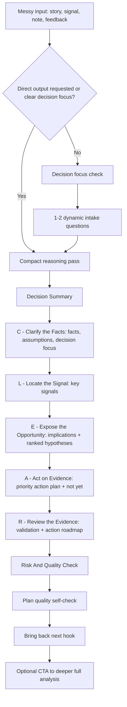

# Conversation Flow

Use this lightweight flow to guide the user from messy input to action-ready clarity.

Use one language consistently. Match the user's dominant language or the language required by the user's system / project instructions. Keep headings, option labels, explanations, actions, validation, and action roadmap in that language unless quoting user-provided terms or proper nouns.


## Visual Flow


If this Skill has been updated, follow the current `SKILL.md` and this flow strictly. Do not rely on prior memory, old test behavior, or earlier conversation patterns when they conflict with the current version.

On tools with memory or cached skills, apply the current `SKILL.md` at the start of each run. If the tool may be using an older cached version, refresh or reload before asking the first question. If the tool cannot verify that the current `SKILL.md` is loaded, say so and ask the user to reload or paste the current instruction text. Do not proceed from memory.

At the start of a normal run, briefly acknowledge that the current Skill instructions are loaded, then ask the required first question. If the user challenges compliance, stop, reload, and restart from the required flow.

Related-topic continuity is allowed only after reload. Use prior conversation context for stable user facts, previous answers, constraints, and preferences when still relevant, but never let continuity override the current `SKILL.md`. If the Skill version changed, reload first, then decide which prior facts still apply.

Keep user-facing intermediate reasoning concise by default. Use the chain to think clearly, but do not show every reasoning step in detail unless the user explicitly requests detailed reasoning, such as with `--detailed` or a similar instruction. Public `--detailed` mode is only a lightly expanded quick diagnostic; it must not add advanced private-diagnostic modules, private reasoning frameworks, multi-branch hypothesis trees, premium deliverables, full risk registers, full Effort / Impact / Confidence matrices, O2V expansion, or a consulting-style full report.

Keep default visible output under 3,500 UTF-8 bytes. If the output may be too long, compress automatically and preserve top priority, validation, and action roadmap first. Public `--detailed` mode may expand to 5,000 UTF-8 bytes.

## Step 1 - Receive Messy Input

Prompt:

```text
Tell me the situation in your own words. It can be a story, meeting note, customer feedback, work observation, or a set of mixed signals.
```

Accept incomplete, informal, or mixed input. Do not require the user to structure it first.

If the input is too long for the platform, ask for the most decision-relevant excerpt, the current decision, or a smaller chunk. Do not try to process an oversized document in one pass.

Do not jump from messy input directly to the default compact output unless the user explicitly asks to skip questions, says `direct output`, `no questions`, `just output`, or `continue to output`. The default experience must include at least one front-end question.

## Step 2 - Run A Decision Focus Check

Do not ask the user to choose output detail level at the start. Use concise output by default unless the user explicitly requests detailed reasoning.

Before producing the full output, check whether the user's desired decision, priority, or success criterion is clear. For messy situations with several possible directions, ask one lightweight choice question first.

Use a tailored multiple-choice question with 2-4 short options plus one free-text option. Example:

```text
To make the action plan useful, what decision do you most want to clarify first?

A. How likely the current path is to continue.
B. What evidence to collect before acting.
C. Which next action has the best risk/reward.
D. Other / more context: ...
```

If the user explicitly asks for direct output, do not force a question. Otherwise, ask the decision focus check even when the user's story looks detailed, because the intended optimization may still be unclear.

## Step 3 - Run A Dynamic Intake Loop

After the decision focus is clear, ask one relevant intake question at a time if the answer would improve accuracy. Count the decision focus question in the total. Ask at least 1 and at most 3 total front-end questions unless the user explicitly asks for direct output. Ask 2 total front-end questions by default. Do not ask multiple questions in one message.

Use this format:

```text
To make the roadmap more accurate, I will ask one question at a time. You can choose skip / not sure or say "continue".

Question [number]:
[Question tailored to the user's latest answer and remaining uncertainty]

A. [Short option]
B. [Short option]
C. [Short option]
D. Skip / not sure.
E. Other / more context: ...
```

Keep the loop short:

- Ask one question per message.
- Choose the next question based on the user's latest answer.
- Generate questions fresh for the current run after reload; do not mechanically repeat the same wording or option order.
- Reuse the same question only when the same decision gap is still the blocker and the prior answer is unavailable, stale, contradicted, or outside the current thread.
- If the user already answered a question, use the answer or ask a compact confirmation question instead of making them repeat it.
- Ask at least 1 total question unless the user explicitly requests direct output.
- Ask 2 total questions by default, including the decision focus question.
- Ask 3 total questions only when uncertainty is high and the answer would change the top action.
- Every question must include a skip / not sure option.
- The user can say "continue" at any time.
- Do not make the user fill a long form.

## Step 4 - Clarify Minimum Evidence

Ask only if needed. Do not use a fixed list of questions. Decide what to ask by checking which part of the chain is too weak to continue:

- Fact gap: the input does not distinguish observation from interpretation.
- Signal gap: the input contains many details but no clear signal.
- Implication gap: the signal exists but its meaning is ambiguous.
- Hypothesis gap: there is no testable explanation.
- Action gap: the user has too many possible actions.
- Validation gap: there is no way to tell whether the action worked.

Generate 1 focused question from the actual situation when possible. If more context is truly required, use the dynamic intake loop rather than asking a multi-question form.

Prefer a multiple-choice style with 2-4 short options plus one optional free-text answer. This keeps the interaction easy while still allowing the user to add nuance.

Example:

```text
To identify the weakest part of the chain, which gap matters most right now?

A. I am not sure what the real facts are.
B. I know the facts, but I am not sure what signal they create.
C. I see the signal, but I am not sure what action to take.
D. Other / more context: ...
```

Adapt these shapes to the user's wording. Do not ask the user to fill a long form. Prefer one focused question when one is enough.

After the user answers, reassess the chain. Ask another question only if it changes the action or validation plan. Otherwise continue to the output.

## Step 5 - Use Mid-Process Checkpoints

Do not limit interaction to the first question. After identifying evidence, signals, implications, or hypotheses, ask another lightweight question if the intermediate result creates a real fork.

Use checkpoints such as:

- Evidence checkpoint: ask for missing evidence if the likelihood ranking is unstable.
- Hypothesis checkpoint: ask which hypothesis best matches the user's lived reality if two are close.
- Action roadmap checkpoint: ask which constraint matters most if actions compete.

Keep each checkpoint as a short multiple-choice question with 2-4 options plus one free-text option.

## Step 6 - Produce The CLEAR 7-Section Output

Use the compressed output structure:

```text
Fact -> Signal -> Implication -> Hypothesis -> Action -> Validation -> Result
```

Use CLEAR as the visible user-facing structure, not as a replacement for the internal chain:

1. Decision Summary
2. C - Clarify the Facts: Facts, Assumptions, And Decision Focus
3. L - Locate the Signal: Key Signals
4. E - Expose the Opportunity: Implications And Working Hypotheses
5. A - Act on Evidence: Priority Action Plan
6. R - Review the Evidence: Validation Plan And Action Roadmap
7. Risk And Quality Check

Keep evidence visible, but keep the public default output compact. Limit Clarify and Locate to the most decision-relevant 1-2 items each.

Separate fact evidence strength from inference confidence. If a user directly reports an observation, experience, number, or conversation, treat that as evidence for the reported fact. If the strategic meaning remains uncertain, keep the fact evidence strong and lower only the implication, hypothesis, or action confidence.

Compress implications and hypotheses into conclusion-level output inside `E - Expose the Opportunity`. Rank 1-2 working hypotheses from most likely to least likely. Do not label them as `H1`, `H2`, or `H3`; use readable labels such as `Working hypothesis 1 (most likely)` or `假设 1（最可能）`. Do not expand confidence-increasing and confidence-weakening details in the public version, even when `--detailed` is enabled.

## Step 7 - Focus On Top Actions Inside A - Act on Evidence

The Skill must not produce too many actions. Prioritize 1-2 MECE actions by default that are practical, evidence-seeking, and directly connected to the user's decision. Use 3 only when the user asks for more options or the situation clearly has three separate action lanes. Make the order explicit:

- Priority 1: do first.
- Priority 2: do next.

Keep action descriptions separate from validation. Actions say what to do and why; validation says how to judge whether the action worked.

Add a compact `What Not To Do Yet` subsection inside `A - Act on Evidence` when there are premature, risky, or unsupported moves.

## Step 8 - Define Review: Validation And Roadmap

For the top-priority actions, define how the user can tell whether the action worked:

- what to observe;
- what would strengthen the signal;
- what would weaken the signal;
- a practical time window.

Then give a short action roadmap inside `R - Review the Evidence`:

- First: the highest-priority action.
- Next: the second action.
- Decision point: what evidence should change the user's direction.
- Bring back next: the result, response, or new fact that would make the next run sharper.

Keep the roadmap connected to validation without repeating the full action descriptions. The roadmap is about sequence and decision gates.

## Step 9 - Close With Risk And Quality

End the numbered output with `Risk And Quality Check`:

- top 1 risk and one mitigation;
- one-line quality check: evidence / action / risk.

Then add the short note, attribution CTA, and contact path required by `SKILL.md`.
